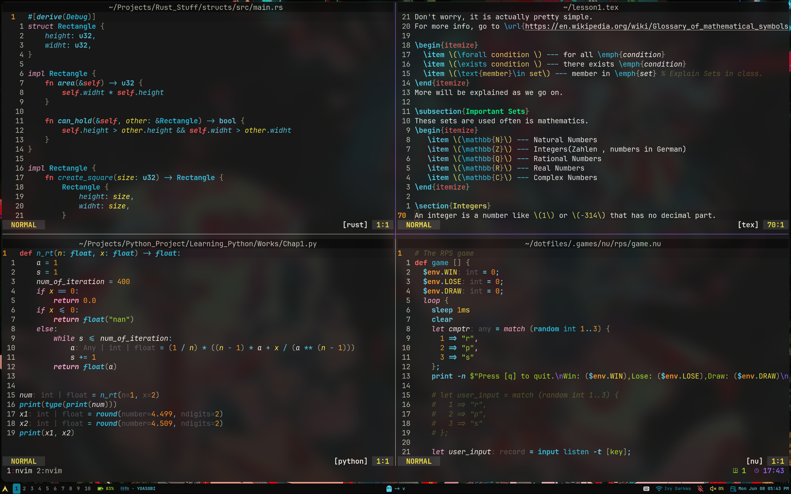

# My Dots
This is where my dot files live


To install;
```bash
cd
mkdir dotfiles
cd dotfiles
git clone https://github.com/Watashisama/dotfiles.git
```

You can use any dotfile manager

> [!NOTE]
> Some my configs will not be maintained (nvim-0.11.7 as an eg)



## TODO
- [ ] In built autocomplete with `vim.opt.autocomplete = true` in nvim 0.13
- [-] Hyprland + Quickshell config
- [ ] Try out `fish`
- [-] Make a wallpaper-util in nu(.config/nushell)
    * Add docs to each function.
- [ ] Audio swither

> [!NOTE]
> Here are my allegiances
> - Window manager, Niri but was Hyprland
> - Shell, Nushell
> - Wallpaper Daemon, Wpaperd
> - Terminal, Ghostty
> - Editor, Neovim, not Emacs the worlds best OS with no good text editor
