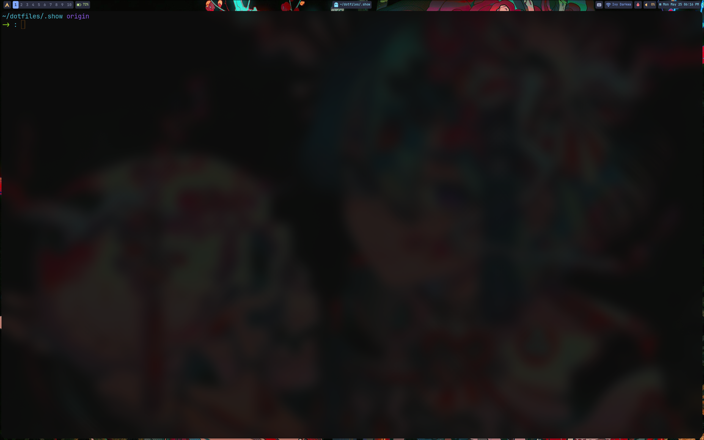
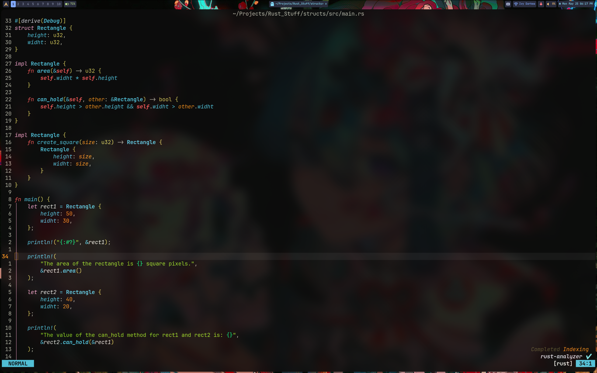

# My Dots
This is where my dot files live



To install;
```bash
cd
mkdir dotfiles
cd dotfiles
git clone https://github.com/Watashisama/dotfiles.git
```

You can use any dotfile manager

> [!NOTE]
> Some configs my not be maintained (nvim-0.11.7 as an eg)

## TODO
- [ ] In built autocomplete with
```lua
vim.opt.autocomplete = true
```
- [x] A colorscheme (異世界-remastered)
